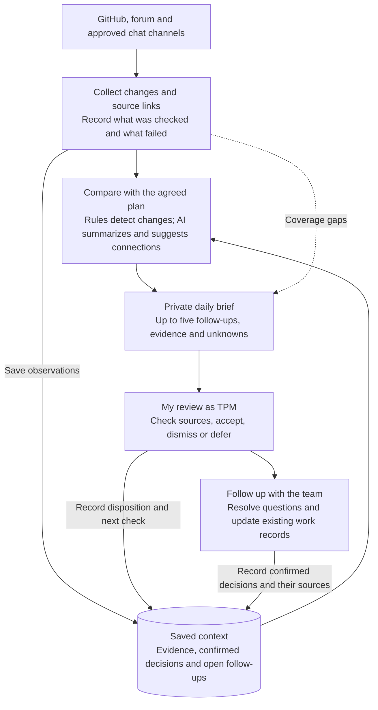

# Part 2: Keeping delivery context current

Joan De Arcayne | 18 September 2026 | PRD and first-month design proposal

[Part 1 overview](README.md) · [Part 1 report](part-1-delivery-triage.md) · [Example daily brief](part-2-example-daily-brief.md)

## Problem and objective

Part 1 required piecing together issues, PRs, reviews, releases, and community discussions. Repeating that work each morning would consume time and risk losing the decisions that explain why something is waiting.

I want a private daily brief that answers three questions: what changed, which commitment could be affected, and what needs my follow-up? It should retain confirmed context, show its sources, and help me decide where to look more closely. I remain responsible for checking its conclusions and following work through.

## First-month scope

Start with one Zebra release and NU7, including their external dependencies. Add selected forum and chat channels once repository coverage is useful and reliable. Synapse is a candidate to assess for reuse; the design does not require a specific tool or database vendor.

The first version reads sources and drafts a brief. Automatic outreach, changes to issues, priority decisions, and release approvals are outside its scope. Broader dashboards and reporting can wait.

## Design

Accepting a suggestion creates a follow-up. It does not turn the suggestion into a confirmed team decision or mark the work complete.

## Sources and collection

| Source | Purpose |
| --- | --- |
| Engineering board and linked GitHub issues, PRs, reviews, checks, and releases | Establish work state and detect changes. Read epics separately because the supplied All Engineering view hides them. |
| Repositories linked to active dependencies | Track the external work needed for the selected commitments. |
| Forum and approved Discord, Signal, or Telegram channels | Find decisions, requirements, incoming requests, and explanations for pauses. Access and collection feasibility must be confirmed for each channel. |
| Team-confirmed plan | Supply agreed scope, owners, checkpoints, dependencies, and completion criteria. Without this baseline, the tool can report change but cannot reliably identify drift. |

Each run records source links, stable item identifiers, source update times, and the last successful collection point. After a missed run it catches up from that point and removes duplicates. Every brief shows coverage gaps, including channels that have not been connected.

## What it remembers

A small persistent record store holds evidence and context independently of the AI conversation. Each work item links to observations, tentative interpretations, confirmed decisions, open follow-ups, and the next check date. A confirmed decision includes its source, date, and responsible person; a later decision supersedes it without erasing the history.

Keep pointers and concise notes rather than whole chat histories. Existing team records remain authoritative for work status and commitments. The retained context helps explain and revisit those records.

## What it surfaces

Rules detect structured changes and missed checkpoints. AI summarizes discussions and proposes connections. Both must point to evidence; inferred dependencies remain tentative until checked.

| Signal | Required behavior |
| --- | --- |
| Review wait or possible stalled work | Flag a missed agreed checkpoint. If none exists, identify the missing expectation rather than declare delay from age alone. |
| Dependency change | Show when a prerequisite is resolved but downstream work remains held, or a release becomes available for adoption. |
| Drift or conflicting evidence | Compare changes with the confirmed plan and show disagreements between sources. |
| External request | Surface it at the next daily check. Flag an unanswered request after one business day to support a first response within one to two business days. |

Group reports about the same work. Retain confirmed pause reasons and only repeat an item when evidence changes or a follow-up is due. Treat merged, released, and activated as separate states. Apply the team's epic conventions: static status and closure with optional scope excluded do not establish inactivity or full delivery.

## Output and human responsibility

The private brief contains source coverage and up to five ordinary follow-ups. Each includes what changed, why it matters, evidence, uncertainty, a proposed action, and the confirmed owner or “unknown.” Other candidates remain available for inspection. Possible urgent concerns appear separately; the daily cycle supplements existing release and security response channels.

I check the sources, accept a suggestion, dismiss it with a reason, or defer it to a checkpoint. Reading an alert does not close the follow-up. I handle outreach and record the resulting decisions in the team's normal workflow. Engineering priorities stay with the Head of Engineering; technical judgments stay with maintainers. I own coordination and the agreed release-readiness process.

The [illustrative daily brief](part-2-example-daily-brief.md) uses the assessment snapshot. It is manually prepared, not generated by a working system.

## Worked example: a resolved blocker and a held release

In Part 1, [release PR #11254](https://github.com/ZcashFoundation/zebra/pull/11254) remained on hold after its named blocker was resolved. The tool should surface that discrepancy and ask what remains, without marking the release ready.

Suppose maintainers confirm a different hold and agree a next-day checkpoint. I would record the reason, source, owner, and checkpoint. The next brief would request the agreed update. If collection failed, it would say “release status not refreshed.” This follow-up scenario is hypothetical.

## Failure handling and acceptance checks

| Failure | How I would detect and handle it |
| --- | --- |
| Stale or invented conclusion | Require links and timestamps, show conflicting evidence, and refresh the source before acting. |
| Missing source or failed collection | Show the last successful check and uncovered period; retry and recover it. Never translate a collection failure into “nothing changed.” |
| Excess noise or missed signals | Compare with manual triage, inspect suppressed items, and check known significant events each week. |
| Summarization or access failure | Fall back to collected facts. Preserve source access restrictions and treat retrieved text as evidence, never instructions. |

Before expanding coverage, test a resolved blocker with a release still held, a deliberately paused issue, a duplicate report, and a failed refresh. Continue only if the trial saves review time, keeps confirmed pauses quiet, and surfaces important changes found in manual checks. Track useful follow-ups, false alarms, known misses, review time, and maintenance effort. These are proposed checks, not measured results.

## Rollout and ownership

| Week | Outcome |
| --- | --- |
| 1 | Agree source access, selected commitments, pause rules, and reference cases. Record the manual review baseline. |
| 2 | Trial GitHub collection and a private daily brief alongside manual triage. |
| 3 | Add selected forum/chat sources where access permits; exercise conflicting evidence and missed-run recovery. |
| 4 | Compare usefulness and maintenance effort with the baseline; keep, adjust, or narrow coverage. |

I would own the triage rules and daily review, and agree who maintains collection and recovery with the team. Channel access, the authoritative plan, and support arrangements are onboarding decisions.

## AI use

Codex helped turn the Part 1 research into this design, draft the diagram, and simplify the explanation. I narrowed the scope to a daily brief, retained human decisions, and corrected an earlier example that asked who would coordinate NU7 dependencies: that is my responsibility as TPM. This proposal has not been built or evaluated.
